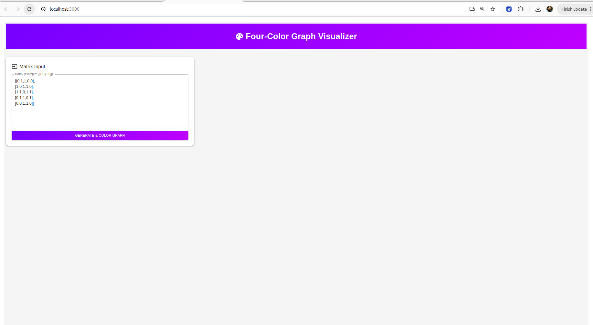
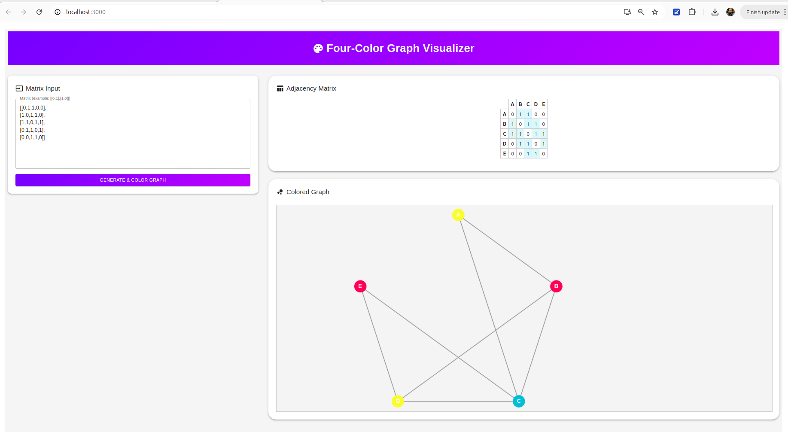

# Four‑Color Graph Visualizer 🖍️

Interactive web app that shows how any planar graph can be colored with ≤ 4 colors.

| Layer     | Tech |
|-----------|------|
| Frontend  | React 18 + TypeScript + Material UI |
| Backend   | ASP.NET Core 8 (Clean / Hexagonal) |
| Containers| Docker Compose (dev‑friendly) |

> **Quick start:** `./build.sh` or see [BUILD_AND_RUN.md](docs/BUILD_AND_RUN.md)

For details on architecture see [BACKEND_ARCHITECTURE.md](docs/BACKEND_ARCHITECTURE.md)  
For algorithmic logic see [ALGORITHMS.md](docs/ALGORITHMS.md)

